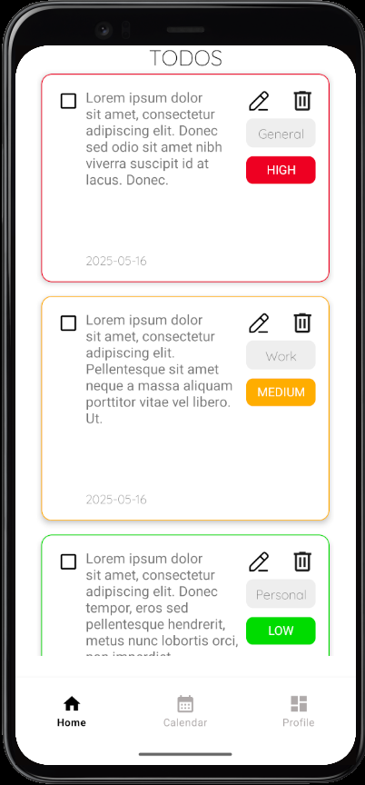
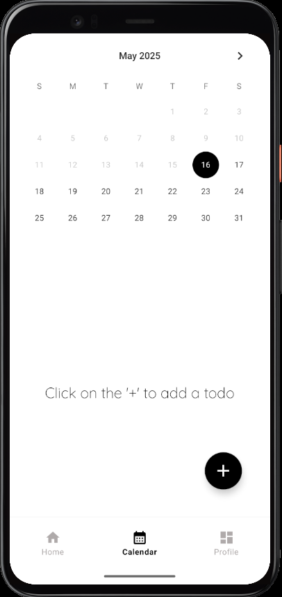
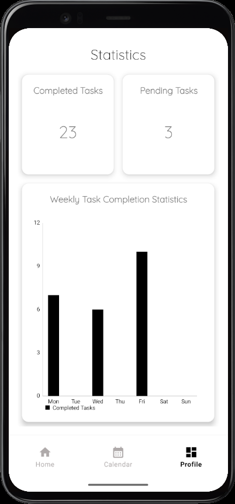

# 📱 ToDoList Android Uygulaması

Bu, Java kullanılarak geliştirilmiş sade bir Android ToDo List uygulamasıdır. Kullanıcıların görev eklemesine, silmesine, güncellemesine, tamamlananları işaretlemesine ve istatistiklerini takip etmesine olanak tanır.

---

## 🖼️ Uygulama Görselleri





---

## 🚀 Özellikler

- Görev ekleme
- Görev silme
- Görev güncelleme
- Tamamlanan görevleri işaretleme
- İstatistikleri görme
- Modern ve sade tasarım

---

## 🛠️ Kullanılan Teknolojiler

- Java
- Android SDK
- XML Layouts

---

## 📦 Kurulum

   ### Android Studio -> Clone Repository -> URL
   ```bash
   git clone https://github.com/AliGalip75/Todo_List.git
